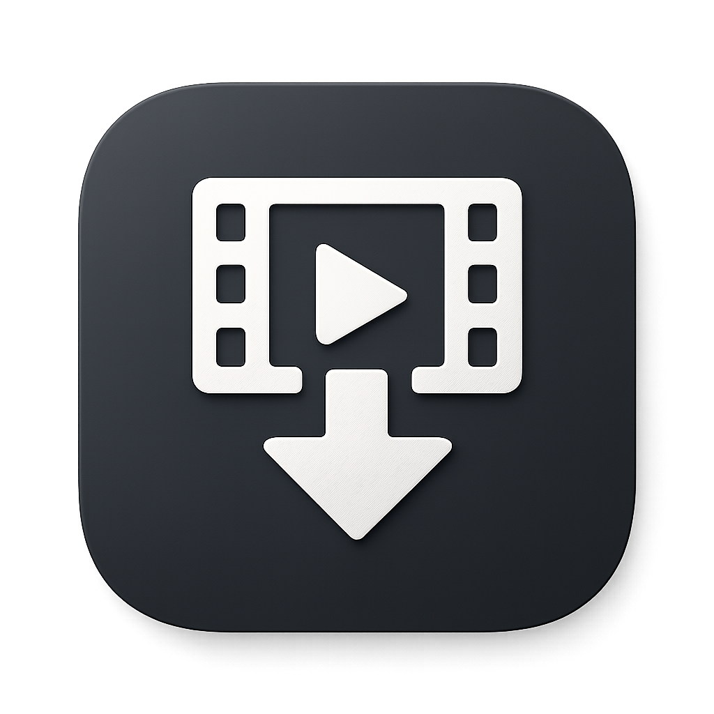

<p align="center">
  
</p>

<h1 align="center">Universal Media Downloader</h1>

<p align="center">
  <b>Minimalist. Fast. Open Source.</b>
</p>

<p align="center">
  <a href="https://vaculte.github.io/UMD/">
    
  </a>
  <a href="https://github.com/Magerko/universal-media-downloader">
    
  </a>
  <a href="./LICENSE">
    
  </a>
</p>

<p align="center">
  
  
  
  
</p>

---

<p align="center">
  Effortlessly download videos and audio from popular web resources —<br />
  privately, locally, and without third-party tracking.
</p>

---

## 📌 Brand Concept

| | |
|---|---|
| **Slogan** | Minimalist. Fast. Open Source. |
| **Brand Type** | Product / Digital (software tool) |
| **Mission** | Да улесни изтеглянето на видео материали от интернет и да го направи лично и поверително, без проследяване от трети страни |
| **Vision** | Всеки потребител да има достъп до прост, бърз и сигурен инструмент за изтегляне на медийно съдържание, който работи локално на неговото устройство |
| **Target Audience** | Широк кръг потребители — от случайни, които искат да запазят видео за офлайн гледане, до напреднали потребители и разработчици, които ценят поверителността, минимализма и отворения код. Продуктът е достъпен за всички ОС (Windows, macOS, Linux) |
| **Tone of Voice** | Приятелски и минималистичен |

---

## ✨ Features

| | |
|---|---|
| 🌐 **Multi-site Support** | YouTube, Twitch, Instagram, TikTok, VK, RuTube, Kick, Kinopoisk & more |
| 🔒 **Private & Local** | Everything runs on your machine — no tracking, no cloud |
| ⚡ **Fast Performance** | Optimized for speed with minimal resource usage |
| 🎥 **Multiple Formats** | MP4, WEBM, MP3 (192kbps audio extraction) |
| 📝 **Subtitles** | Download subs in English, Russian, and Ukrainian |
| 🌍 **Multi-language UI** | Interface available in English, Russian, and Ukrainian |
| 🧩 **Open Source** | Transparent, collaborative, community-driven development |

---

## 📸 Screenshots

<p align="center">
  <i>Скрийншоти на приложението се намират в <code>docs/site/</code></i>
</p>

<!--
<p align="center">
  
  
</p>
-->

---

## 🚀 How It Works

```
1️⃣ Copy link  →  2️⃣ Paste link  →  3️⃣ Choose format  →  4️⃣ Download
```

1. **Copy the link** — from any supported platform (YouTube, Twitch, Instagram, etc.)
2. **Paste the link** — UMD instantly detects the source
3. **Choose format & quality** — MP4, WEBM, MP3 / 1080p, 720p, bitrate
4. **Download** — fetched and saved directly to your device

---

## 💻 Installation

<details>
<summary><b>Windows</b></summary>

```powershell
# Install Deno
irm https://deno.land/install.ps1 | iex

# Install FFmpeg
winget install ffmpeg

# Clone & Setup
git clone https://github.com/Magerko/universal-media-downloader.git
cd universal-media-downloader
python -m venv .venv
.venv\Scripts\activate

# Install & Run
pip install -r requirements.txt
python main.py
```

</details>

<details>
<summary><b>macOS</b></summary>

```bash
# Install Deno
curl -fsSL https://deno.land/install.sh | sh

# Install FFmpeg
brew install ffmpeg

# Clone & Setup
git clone https://github.com/Magerko/universal-media-downloader.git
cd universal-media-downloader
python3 -m venv .venv
source .venv/bin/activate

# Install & Run
pip install -r requirements.txt
python3 main.py
```

</details>

<details>
<summary><b>Linux</b></summary>

<b>Debian / Ubuntu:</b>
```bash
sudo apt install ffmpeg
```
<b>Fedora:</b>
```bash
sudo dnf install ffmpeg
```
<b>Arch:</b>
```bash
sudo pacman -S ffmpeg
```

```bash
# Install Deno
curl -fsSL https://deno.land/install.sh | sh

# Clone & Setup
git clone https://github.com/Magerko/universal-media-downloader.git
cd universal-media-downloader
python3 -m venv .venv
source .venv/bin/activate

# Install & Run
pip install -r requirements.txt
python3 main.py
```

</details>

---

## 🧱 Tech Stack

| | |
|---|---|
| **Frontend** | HTML5 (семантичен), CSS3 (custom properties, flexbox, grid, glassmorphism, `backdrop-filter`, `clamp()`), JavaScript (Vanilla ES6+) |
| **Icons** | Feather Icons, Devicon |
| **Typography** | Montserrat (400/500/600/700) · Dela Gothic One |
| **Backend** | Python + Deno + FFmpeg |
| **Hosting** | [GitHub Pages](https://pages.github.com/) |

> ⚠️ Bootstrap 5.3 **не е използван** — по договорка с преподавателя е разрешено използването на кастомен CSS със собствени наработки, тъй като проектът надхвърля стандартните изисквания.

---

## 🎨 Visual Identity

### Logo Concept
Текстов логотип (wordmark / lettermark), базиран на шрифта **Dela Gothic One**. Избран е този тип, защото минимализмът е водеща ценност на бранда — не са необходими сложни графични елементи. Абревиатурата "UMD" е централен визуален елемент, който се появява в навигацията и фавикон-концепцията. Шрифтът е геометричен, смел и с висок контраст, което комуникира технологичност и модерност. Буквите U-M-D образуват симетрична и стабилна композиция, която се мащабира еднакво добре от фавикон до банер.

### Color Palette

| Role | HEX |
|---|---|
| **Primary text & accents** | `#0a0a0a` |
| **Light background** | `#ffffff` |
| **Secondary text** | `#555555` |
| **Muted text & icons** | `#999999` |
| **Aurora pink (gradient)** | `#ffb4dc` |
| **Aurora blue (gradient)** | `#96dcff` |
| **Aurora yellow (gradient)** | `#ffe696` |

### Visual Style
Минималистичен **glassmorphism** дизайн със заоблени форми (radius 24px / pill), полупрозрачни повърхности с `backdrop-filter: blur(15px)`, aurora градиенти на фона (розови, сини и жълти нюанси), Feather икони и монохромна палитра. Повърхностите са гладки и чисти — без текстури, съобразено с философията на минимализма.

---

## 🧩 Interactive Elements

### 1. Screenshots Lightbox
При клик върху скрийншот в секция `#screenshots` JavaScript създава динамично lightbox елемент със затъмнен фон (`rgba(0,0,0,0.85)`). Изображението се отваря на цял екран с плавна анимация (`transform: scale` от 0.95 към 1). Затваряне по клик върху бутон X, по клик извън изображението, или по натискане на Escape.

### 2. Theme Toggle (Dark / Light Mode)
Бутон `#theme-toggle` в навигацията. При клик JavaScript сменя `data-theme` атрибута на `<html>` между `"dark"` и `"light"` и запазва избора в `localStorage`. При зареждане темата се възстановява автоматично. Иконата се сменя динамично (☀️ / 🌙). CSS превключва всички custom properties (цветове, бордъри, сенки) с плавен `transition`.

### 3. OS Cards Accordion
В секция `#installation` JavaScript слуша `click` върху `.os-card-header`. При клик се проверява дали картата е отворена — ако е, се затваря; ако не е, първо се затварят всички други карти (само една отворена едновременно), след което се отваря избраната. Анимацията се реализира чрез CSS `transition` върху `max-height`, `padding` и `border-top`. Chevron иконката се завърта с `transform: rotate(180deg)`, а border-radius-ът се сменя от `pill` към `24px`.

### 4. Copy to Clipboard
JavaScript обхожда всички `<pre>` елементи и създава динамично `<button class="copy-btn">` за всеки блок. При клик се използва `navigator.clipboard.writeText()` за копиране на съдържанието на `<code>`. Бутонът показва обратна връзка — текстът става "Copied!" за 2 секунди, след което се връща на "Copy". Бутонът е абсолютно позициониран в горния десен ъгъл.

### 5. FAQ Accordion (Native Details/Summary)
В секция `#faq` се използват чисти HTML5 `<details>` и `<summary>` елементи **без JavaScript**. CSS `::after` псевдоелемент добавя chevron иконка чрез inline SVG data URI. При `[open]` chevron-ът се завърта с `transform: rotate(180deg)`. Всеки въпрос има разделителна линия (`border-bottom`) за ясна сканираемост.

### 6. Scroll Reveal Animation
Реализирана чрез **IntersectionObserver** API. Всички елементи с клас `.reveal` започват с `opacity: 0` и `transform: translateY(24px)`. Когато елементът влезе във видимата област (threshold 0.1), се добавя клас `.visible`, който анулира трансформациите с CSS `transition`. Ефектът е плавно "изплуване" на съдържанието при скролване.

---

## ❓ FAQ

<details>
<summary><b>What platforms are supported?</b></summary>
YouTube, TikTok, Instagram, VK, RuTube, Twitch, Kick, Kinopoisk, and many more.
</details>

<details>
<summary><b>What video quality and formats are available?</b></summary>
Quality is configured per platform. Supported formats: MP4, WEBM, and MP3 for audio.
</details>

<details>
<summary><b>Does the app support subtitles?</b></summary>
Yes — English, Russian, and Ukrainian.
</details>

<details>
<summary><b>What languages does the UI support?</b></summary>
English, Russian, and Ukrainian.
</details>

<details>
<summary><b>Can I download audio only?</b></summary>
Yes — audio extraction to MP3 at 192kbps.
</details>

---

## 🧠 AI Assistance

This project was built with help from AI tools (ChatGPT / Claude) for:
- Генериране на идеи за бранд концепция и визуална идентичност
- Помощ при писане на HTML, CSS и JavaScript код
- Оптимизация и рефакторинг на стилове
- Създаване на текстово съдържание за сайта

---

## 🔗 Links

- 🌐 **Live Site**: [vaculte.github.io/UMD](https://vaculte.github.io/UMD/)
- 📦 **Backend Repo**: [github.com/Magerko/universal-media-downloader](https://github.com/Magerko/universal-media-downloader)
- 📄 **Documentation**: [README on GitHub](https://github.com/Magerko/universal-media-downloader/blob/main/README.md)

---

<p align="center">
  <sub>Built with ❤️ and ☕</sub>
</p>